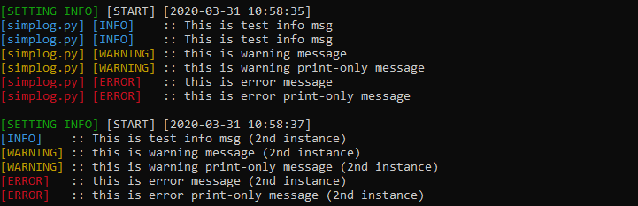
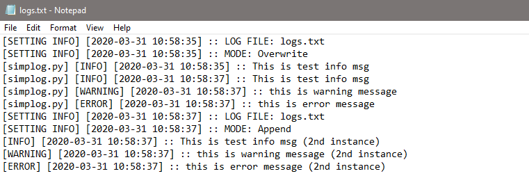

# InstantLog
This is basic logger for printing messages to the terminal and a file in the same time. My idea of creating this tool was to have small and simple logger with minimal number of parameters controlled by user.  
Date/time information is provided in every log in a file but not printed in the console. There is optional field for printing additional statement in the square brackets. It is set once during initialization. I found it usefull for programs consisted of multpile modules, to know which module is logging.

See an example below:





## Usage
Minimal example for use:
```python
from instantlog import InstantLog
log = InstantLog()
log.i("This is test info msg", True)
```
#### Init parameters:
All of the following parameters are optional:
* `name=None` (str) -- additional pair of square bracket info. Putting the `__file__` as `name` gives info about which module is actually logging. 
* `file_pth="logs.txt"`(str) -- A string pointing text file (existing or not). This file will be used for collecting logs
* `append=True`(boolean) -- If `True`, and if there is any content in `file_pth`, current logs will be appended to the end of file. Otherwise, the file will be cleared before appending new logs.  

#### Method Parameters:
There are three methods to use. They are called short for line-length saving. The `i` for info, `w` for warning, and finally `e` for error prompt. The only difference is in terminal print color. Infos are blue, warnings yellow (in Windows 10 PowerShell they are white), and errors are red. Each of them has 2 possible parameters:
* `msg` (str) -- Mandatory. Any string, a message for the user.
* `to_file=False` (boolean) -- Optional, if `True`, the log message will be displayed in standard output only. Otherwise, the same message with date and time will be stored in the log file. 

## NOTE:
* Tested at Linux system (Fedora).
* This tool is using external package "colorama". 
* If your program has more than one module and you want to initialize more than one simplog instance, please use append=True to prevent overwritting log file during next initialization. 
* Yellow color is not properly displayed by the PowerShell, in this case messages are going to be white. If you are using Command Prompt, all colors should be displayed correctly. 
